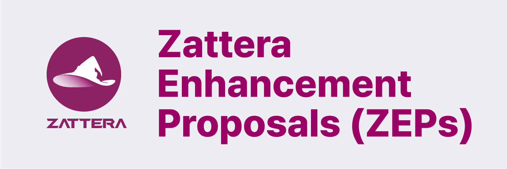

<div align="center">



[English](README.md) | [日本語](README.ja.md)

</div>

# Zattera 개선 제안 (ZEPs)

이 저장소는 Zattera 블록체인 프로토콜에 대한 모든 Zattera 개선 제안(ZEP)을 포함합니다.

## ZEP란 무엇인가?

**ZEP(Zattera Enhancement Proposals)**는 Zattera 커뮤니티에 정보를 제공하거나 Zattera의 새로운 기능, 프로세스 또는 환경을 설명하는 설계 문서입니다. ZEP는 기능의 간결한 기술 사양과 해당 기능에 대한 근거를 제공합니다.

ZEP는 프로토콜 수준 변경 사항과 애플리케이션 수준 표준을 모두 다룹니다. 애플리케이션 수준 표준(Ethereum의 ERC와 유사)은 "Application" 카테고리를 가진 Standards Track ZEP입니다.

이 구조는 Ethereum의 EIP/ERC 시스템에서 영감을 받았습니다.

## ZEP 유형

ZEP는 여러 유형으로 구분됩니다:

- **Standards Track ZEP**: 대부분 또는 모든 Zattera 구현에 영향을 미치는 변경 사항
  - **Core**: 합의 포크가 필요한 개선 사항 (예: ZEP-2, ZEP-4)
  - **Networking**: 네트워크 프로토콜 사양 개선 사항
  - **Interface**: API/RPC 사양 및 표준
  - **Application**: 다음을 포함한 애플리케이션 수준 표준 및 규약:
    - 플러그인 인터페이스 및 동작
    - 지갑 형식 및 키 관리
    - API 규약
    - JSON 메타데이터 형식 및 URI 스키마

- **Meta ZEP**: 프로세스 변경 또는 프로세스에 대한 결정(예: ZEP-1 - 절차, 가이드라인, 의사 결정)

- **Informational ZEP**: 설계 이슈, 일반 가이드라인 또는 커뮤니티에 대한 정보(새로운 기능을 제안하지 않음)

## ZEP 워크플로우

### 1. 아이디어 단계
- 커뮤니티 포럼에서 아이디어 논의
- 핵심 개발자와 개념 검토
- 아이디어가 독창적이고 기술적으로 타당한지 확인

### 2. 초안 단계
- 작성자가 템플릿을 사용하여 ZEP 문서 작성
- 이 저장소에 풀 리퀘스트 제출
- 편집자가 ZEP 번호 할당
- 상태: **Draft**

### 3. 검토 단계
- 커뮤니티가 검토하고 피드백 제공
- 작성자가 피드백을 기반으로 수정
- 핵심 개발자의 기술 검토
- 상태: **Review** 또는 **Last Call**

### 4. 최종 단계
- 대략적인 합의 달성
- 구현 완료(Standards Track의 경우)
- 상태: **Final**

### 기타 상태
- **Stagnant**: 6개월 이상 비활성
- **Withdrawn**: 작성자가 제안 철회
- **Living**: 지속적으로 업데이트(예: ZEP-1)

## ZEP 형식

모든 ZEP는 다음 구조를 따라야 합니다:

```markdown
---
zep: <ZEP 번호>
title: <ZEP 제목>
description: <짧은 설명>
author: <이름> (@github), <이름> <email>
discussions-to: <URL>
status: Draft | Review | Last Call | Final | Stagnant | Withdrawn | Living
type: Standards Track | Meta | Informational
category: Core | Networking | Interface | (Standards Track에만 필요)
created: YYYY-MM-DD
requires: <ZEP 번호> (선택 사항)
---

## Abstract
간략한 기술 요약

## Motivation
왜 필요한가?

## Specification
기술 사양

## Rationale
설계 결정 및 대안

## Backwards Compatibility
주요 변경 사항 및 마이그레이션

## Test Cases
구현을 위한 테스트 케이스

## Reference Implementation
구현 링크

## Security Considerations
보안 의미

## Copyright
저작권 포기
```

## 기여하기

ZEP를 제출하려면:

1. **Fork** 이 저장소를 포크합니다
2. **Copy** `zep-template.md`를 `ZEPs/zep-XXXX.md`로 복사합니다(기존 ZEP를 확인하여 다음 사용 가능한 번호 사용)
3. **Fill out** 제안 내용으로 템플릿을 작성합니다
4. **Submit** 풀 리퀘스트를 제출합니다
5. **Editor reviews** 편집자가 검토하고 병합 전 필요시 ZEP 번호를 재할당할 수 있습니다

### 제출 전 확인 사항

- **[ZEP-1: ZEP 목적 및 가이드라인](ZEPs-ko/zep-1.md) 읽기** - 상세한 프로세스 및 형식 요구 사항 확인
- 아이디어가 이전에 제안되지 않았는지 확인
- 먼저 커뮤니티 채널에서 논의
- ZEP 형식을 엄격히 준수
- 모든 필수 섹션 포함
- 적절한 마크다운 형식 사용
- 명확한 기술 사양 제공

### ZEP 편집자

ZEP 편집자의 책임:
- ZEP 번호 할당
- ZEP 형식 검토
- 기술적 타당성 확인
- 승인된 ZEP 병합
- ZEP 상태 변경 관리

현재 편집자:
- Zattera Core Team

## 라이선스

모든 ZEP 및 ZRC는 [CC0 1.0 Universal](https://creativecommons.org/publicdomain/zero/1.0/) 라이선스로 배포됩니다.
